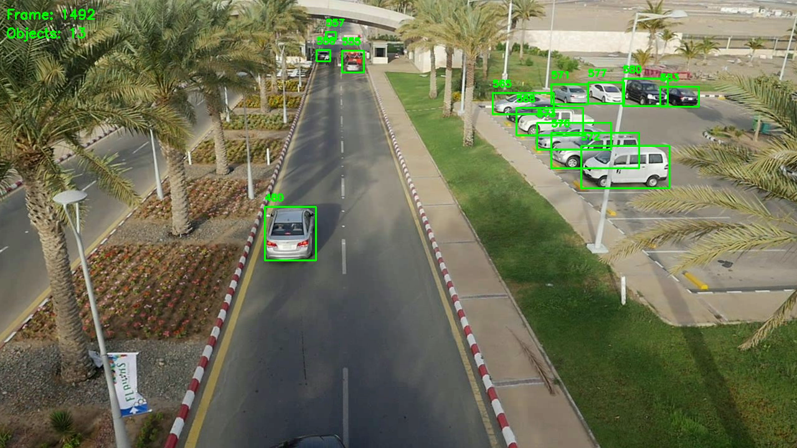

# Simple Ultralytics-Based Car Tracking from UAV

This repository provides a minimal example of car detection and tracking from aerial (UAV) footage using Ultralytics YOLOv8. 
It combines detection and tracking logic into a unified pipeline, leveraging YOLOv8’s `track()` function and custom tracking state management.

## Features

- YOLOv8s fine-tuned on VisDrone dataset
- Runs in Ultralytics official CPU Docker container
- ByteTrack tracker with class-agnostic NMS and merged vehicle classes
- Maintains per-object history (position, confidence, center) across frames
- Efficient tracking logic with automatic cleanup of stale tracks
- Annotated frame output with object ID overlays and metadata
- Runs at ~11 FPS on Intel i9-9820X with batch size = 1

## Quick start
```bash
Put videos in tracking_videos folder

git https://github.com/trnmentoring/car_tracking
cd car_tracking
docker pull ultralytics/ultralytics:latest-cpu

docker run --rm -it --shm-size 4G \
  --workdir $(pwd) \
  --mount type=bind,source=$(pwd),target=$(pwd) \
  --user root \
  --network host \
  ultralytics/ultralytics:latest-cpu

python3 main.py --config configs/default.yaml
```

## Potential improvements 
- Retrain detection model on more amount of opensource UAV-view car data
- YOLO custom configuration for our case
- External tracker with for better assignment and initiation
- Model optimization, like quantization with openvino
- More visualization options
- Skip frames, timebuffer for real stream
- Motion compensation
